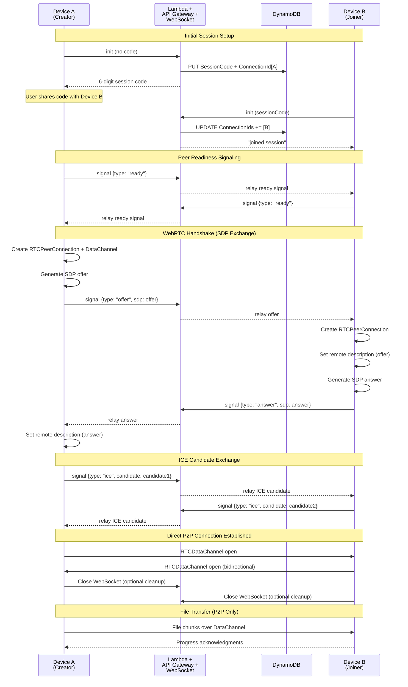

# <a href="https://pourtle.com" style="color:rgb(78, 158, 237);; font-weight: inherit; text-decoration: underline;">Pourtle</a>'s Backstory
\
This isn't a startup, but it was fun to give this project one of those startup-y names. Find a word that feels related to your product in some way, then mess with it a little bit to create a spelling that resembles that word. But it cannot be directly that word. Something something cool factor.

Spoiler, I thought of **portal** first as my relevant word. A few hours of creative brainstorming, ideation, and long discussion, and Pourtle was born. It's like it was meant to be.

Why is portal relevant though? What is this?

I consider myself technologically savvy. Growing up, my dad brought internet to our house in 1997. I've had Facebook since 2007. Smart phones since 2009 (shout out Palm Pre). Dropbox since 2010. And a software engineering - related degree since 2015. The diploma says Electrical Engineering but there was a lot of coding within that curriculum.

All that, and **I still struggle to move my digital content between my devices**. I can't tell you the amount of times I've sent myself a photo on Facebook Messenger to get a picture from my iPhone onto my PC. Or a blob of text that I needed to copy/paste. OR A URL! Just enthusiastically remembered that use case and it's a constant pain point. Facebook Messenger for whatever reason has been the lightest weight mechanism I use to do this which is now a habit.

This isn't unchartered territory though. Apple demonstrates masterclass in this problem space, as long as you use Apple products. A number of cloud services with names containing "Box" or "Drive" exist for this as well. My last project at Microsoft even aimed to solve this.

There's always a catch though. Some quid pro quo. Whether that's monetary, advertisement mind share, data collection, etc. You're valuable and companies take a little bit of your value in exchange for the value they provide. There's nothing wrong with that, it's the basis of business. But in my experience, that requirement has always surfaced through an elongated user experience to accomplish the goal of moving content.

_Sign-in's, downloads, installs, uploads, sign-ups, syncs, etc. etc._

There's also often the compromise of sharing your content with a company. Letting them see it, letting them process it, letting them store it. Privacy is front and center in a lot of ways at a lot of companies, but things can and do go wrong. Hackers are unfortunately good at their jobs and attacks or leaks make headlines every now and then.

Okay, enough spotlighting what is not the biggest problem the world is facing today. The existing solutions are good enough for most and I put up with them from time to time. Let me bookend this section.

I saw an opportunity for a fun project that adds regular and simple value to my life. I have a lot of devices and a lot of content across those devices. And I fairly often need to move my content between my devices. So I built myself (and any of you that want to try it) a connection between my devices to move my content.

Like a portal. Sorry, pourtle **.
 
 

# Overview
\
**30 second elevator pitch! Read quick!**

Need to move a photo, file, link, or more between your phone and computer?

1. Go to [pourtle.com](https://pourtle.com) on your computer
2. Click Get Started and scan the QR code with your phone's camera
3. Your phone and computer are connected! Share whatever between the two devices

No accounts, no uploads, no storing your content somewhere in the cloud. Just a direct connection between your devices to move your content. When you're done, just close out of it and know all your content remains only on your devices.

<figcaption style="text-align: center; font-size: 0.98em; color: #aaa; margin-top: 0.5em;">
  Pourtle user experience as seen on both computer and phone
</figcaption>
 
 

# Technically Speaking
\
One of my favorite things about software engineering is the ability to imagine something, and then just build it. It can sometimes feel like creating art out of logic, and more often than not the only resource required is time.

The more you do this though, the more you realize how frameworks can expedite that process and hone in your thinking to a high-quality solution. I lean into that here.

## First Principles

I approached this space from first principles.

**Problem**: Your content may exist on one device when you have a one-off need for it on a different device.

**Conventional thinking**: Cloud-based, account-based, or closed-ecosystem solutions are standard

### Step 1: Question the Assumptions

1. **Why are cloud solutions popular?** For repeated access on multiple devices
2. **Why are accounts required?** For cloud access and/or business value  
3. **What is the minimum technical solution that could solve this?** A direct data connection between two devices

### Step 2: Break Down the Requirements

* **One-time transfer** – No need for repeated access or persistent storage
* **Cross-platform** – Must work across all platforms and devices (with internet)
* **No friction** – No downloads, no sign-ups, no learning curve
* **Privacy** – Content shouldn't leave a user's devices

### Step 3: Explore the Technical Landscape

Browsers are one of the common denominators across all personal computing devices with internet access and are user expectation. This spans phones, tablets, and PCs, which are also the surfaces most often used to interact with your content.

Examining browser technologies and what could be leveraged, the industry-standard **WebRTC** peer-to-peer protocol appeared as the perfect candidate for a real time, secure data connections directly between devices.

It's not an out of the box solution though, rather an interface of common functionality that (essentially) all browsers implement and make available to applications for consumption. The application layer atop it has a few responsibilities:
- **Signaling** – Coordinate the initial handshake between peers (offer/answer exchange)
- **Connection management** – Handle ICE candidate exchange and connection state
- **Data channel setup** – Establish the bidirectional data pipe for file transfer
- **File chunking** – Break large files into manageable pieces for reliable transfer
- **Error handling** – Gracefully manage network issues and connection drops
- **Session management** – Generate unique session codes and validate peer connections

Those application requirements felt achievable and equally a fun learning challenge for me. I had not previously worked with WebRTC but came away eager to get my hands dirty. Onwards.

### Step 4: Define the Solution

With the work cut out for me above, I dove into defining how this will actually look in code.

#### The Web App

The overarching solution is comprised within web technology to leverage the browser's WebRTC functionality, and served as a web app from the domain pourtle.com. While multiple web frameworks and hosting solutions could've been chosen, I sided with a stack familiar to me:
- **React**: open-source front-end JavaScript library optimized for user interfaces
- **JavaScript**: the programming language used with React (note TypeScript could have also been used)
- **Material UI**: React component library implementing Google's Material Design Language
- **AWS S3/CloudFront**: Static web hosting with a global CDN to distribute

Contained within this web application are my WebRTC implementations for the user experience, connection management, setup, file chunking, and error handling. Sparing the nitty gritty details, some clean layering is in place to provide the UI layer with a simple messaging abstraction to send and receive a file, photo, or text. 

#### Backend Service

The most ambiguous piece which I'd like to focus on entails building the signaling channel paired with the session management. The WebRTC protocol entails an initial handshaking sequence that is established on an external transport (as the WebRTC connection doesn't exist yet).

First, let's establish roles. Every Pourtle session consists of two devices. One acting as a **creator** (starts the session, gets a 6-digit code) and one acting as a **joiner** (enters that code).

##### The Flow

1. **Creator** device visits pourtle.com → backend generates unique session code → code displays on screen
2. **Joiner** device scans/enters code on pourtle.com → backend matches with creator device → both devices know they found each other
3. **Handshake begins** → devices exchange WebRTC setup messages _through_ my backend
4. **WebRTC connects** → backend steps aside, devices talk directly

##### The Architecture

Admittedly I'm cheap when it comes to projects like these. Why pay Amazon for a server to run 24/7 that I use <10 times per month when I could instead pay them for Prime and HBO Max (with ads)? **AWS Lambda + API Gateway WebSockets** means I only pay when someone's actually connecting devices. Widely known as a serverless architecture.

There's a stateful piece to this too. This state lives in **DynamoDB**:
- Creator starts session → store `{sessionCode: "123456", creatorId: "abc"}`  
- Joiner enters code → update to `{sessionCode: "123456", creatorId: "abc", joinerId: "xyz"}`
- Now when "abc" sends a message, the backend can relay it to "xyz".

This relay messaging allows them to exchange WebRTC handshake info, and upon completion the backend becomes irrelevant. Direct peer-to-peer connection takes over. **Aka WebRTC!**

I'm a visual learner, in case you are too:

 
 

#### Conscious Design Decisions

I am intentionally omitting the use of a [TURN server](https://en.wikipedia.org/wiki/Traversal_Using_Relays_around_NAT) at this point. 

This equates to **devices must be on the same network to share content**.

My reasoning for this choice:
1. **Cost**: a TURN server would add compute cost and while valuable, again I'm already paying for HBO Max (with ads).
2. **Use cases**: a user's devices (particularly mine) are very frequently on the same network, where there is no need for a TURN server in the first place
3. **Privacy**: Content is more secure given it is not traversing across networks.
4. **Complexity**: [K.I.S.S.](https://en.wikipedia.org/wiki/KISS_principle), no pressing need

This is not an irreversible decision. A TURN server could be added in some day if it made sense.

### Step 5: Write the code

Feel free to check it out! [Repo](https://github.com/afisch710/quick-relay)

## I Love Feedback

Thanks for taking the time to read this post and hopefully you had a chance to play around with [pourtle.com](https://pourtle.com). If you notice any issues, have any feedback, or just want to have a conversation, you can absolutely reach out to me at any of the social links below.
 
 
Cheers!